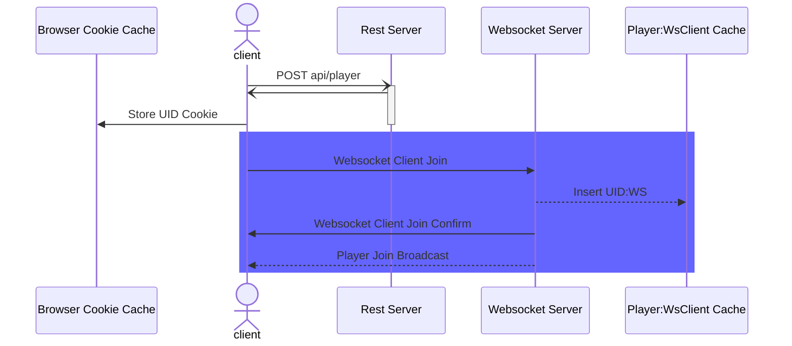
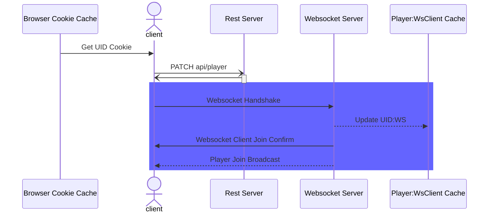
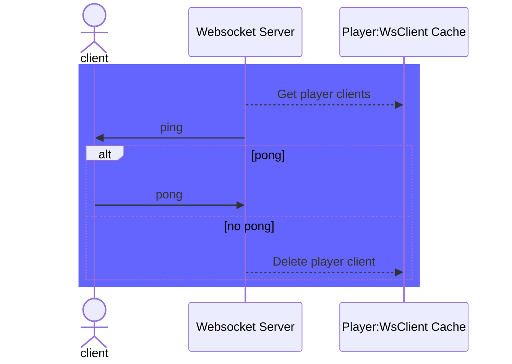

# Player Connection Documentation

If the player joins a room and does not have a UID cookie, the player calls a `POST` endpoint on the server. The server creates a UID and returns this to the client. The client stores the UID it receives as a cookie. The client then makes websocket connection to the server with the UID. The server inserts the player's UID with the websocket client in a cache.

## New Player Join

## Player Rejoin

Players rejoin when the socket was closed (e.g., tab hibernates, computer goes to sleep, browser tab was closed, or player clicks reload). The client takes the player UID from the cookie cache and creates a new websocket connection with the websocket server. The websocket server updates its cache with the new websocket client object, deleting the old client object.

## Player Heartbeat

A heartbeat is needed for two purposes: 

1. to keep the connection from being seen as idle and killed by intermediate networking (e.g., proxies, load balancers, etc)
2. so that the server can detect players who leave or lose connection

The heartbeat is a ping / pong mechanism wherein the server pings the client who responds with a pong. If the client does not respond, then the server deletes that client entry in its cache of player clients.

